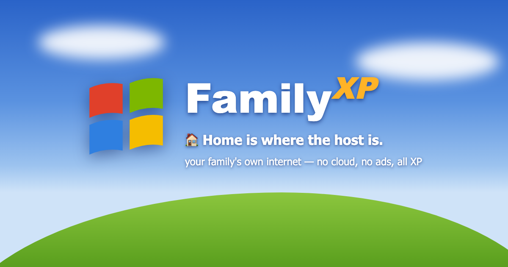
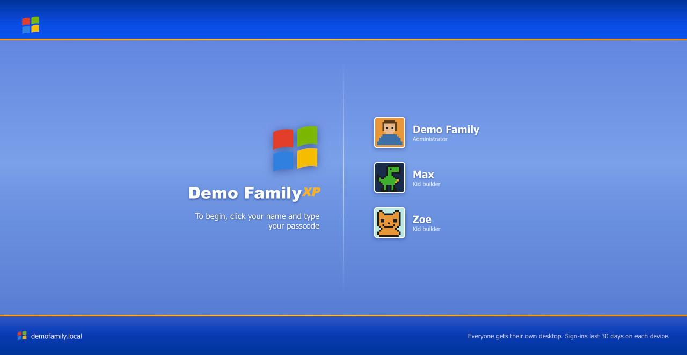
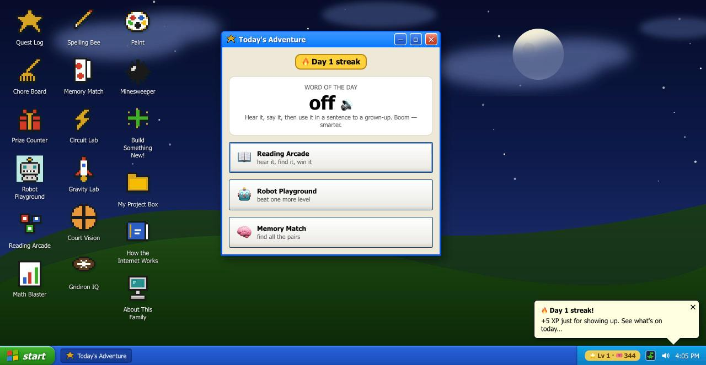
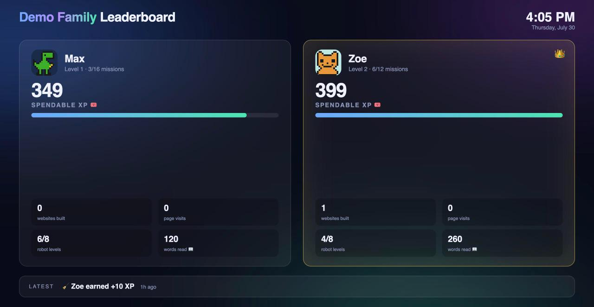

# Family XP 🏠

> **Home is where the host is.** A Windows-XP-style "family computer" that runs
> on a Mac in your living room. Chores become XP. XP becomes real prizes —
> *you pick the next family dinner*, *$10 to your savings*, *one YES to any
> reasonable ask*. And the built-in arcade quietly teaches reading, spelling,
> math, circuits, physics, coding and sports IQ.
>
> **No cloud. No accounts. No ads. No subscriptions.** Your kids' data never
> leaves your house — it even works when the internet is down.



## ✨ See it

| Every kid gets their own sign-in card… | …and their own desktop, fresh every day |
|---|---|
|  |  |

Each morning, **Today's Adventure** greets them by name, *speaks* a word of the
day out loud, and deals three activities. Login streaks pay XP. Everything
kid-facing talks — pre-readers can use all of it.

**And on the living-room TV:**



The leaderboard updates live — approve a chore from your phone and the TV
erupts in confetti. The 👑 moves in real time.

## 🕹️ What the kids get

- **Their own real websites** — one tap scaffolds a page, an in-browser Code
  Editor shows the actual HTML, and Paint drawings publish straight onto it.
  Grandma can sign the guestbook.
- **A Quest Log** of missions mapped to real CS standards, auto-verified
  against the kid's actual code ("add a second button" ✓ = confetti + XP).
- **A learning arcade with bottomless levels** (they scale procedurally past
  1000): Reading Arcade & Spelling Bee (the iPad *says* the word), Math
  Blaster (spoken questions), Memory Match, Robot Playground (sequences →
  loops → typed code), Circuit Lab (animated electron flow!), a real-physics
  slingshot lab, Court Vision (5-on-5 basketball IQ) and Gridiron IQ.
- Minesweeper, a starfield screensaver with the corner-hit you always waited
  for, and a helpful paperclip. You know the one.

## 👨‍👩‍👧‍👦 What parents get

- **Chore Board HQ** — post chores with daily/weekly cadence; kids tap
  *"I did it!"*; you approve; XP lands. The **Prize Counter** reserves XP until
  you make the prize official.
- **Control Panel** — up to 10 kids, rename/reset/redo-setup, one-tap ZIP
  export of any kid's data, XP grant/deduct with an audit ledger, quest
  editing, integrity checker.
- **Boring-in-a-good-way plumbing**: atomic writes with automatic backups,
  corruption quarantine + self-recovery, nightly ZIP backups, a self-healing
  watchdog, and a 36-test end-to-end suite run by CI.

## 🚀 Getting started (no tech skills needed)

You need: **a Mac** that stays home (any Mac from the last ~8 years), and
about **5 minutes**.

1. **Download**: click the green **Code** button at the top of this page →
   **Download ZIP** → double-click the ZIP to unpack it. Drag the `family-xp`
   folder somewhere permanent (like your home folder).
2. **Install**: open the folder and **double-click `install.command`**.
   (If macOS says it's from an unidentified developer: right-click it →
   **Open** → **Open**. That's Apple being careful, one time only.)
3. **Answer one question** — your family name — and you're live.
4. On any phone, tablet or laptop **on your home wifi**, open the address it
   prints (like `http://smithfamily.local/`). Hand each kid their sign-in
   card: they pick their own name, avatar, wallpaper world and secret passcode
   in an XP-style setup wizard.
5. **You** sign in with the parent passcode it printed, open the **Chore
   Board**, and post your first chore. That's it.

💡 *Tips: add it to kids' iPad home screens (Share → Add to Home Screen), put
`/leaderboard` on the TV, and download a "Premium" Siri voice in Settings →
Accessibility → Spoken Content for the softest read-aloud voice.*

**Comfortable with a terminal instead?**
```bash
git clone https://github.com/mutaaf/family-xp && cd family-xp && ./install.sh
```

## ❓ FAQ

- **Is it safe?** Everything runs and stays on your Mac. Passcodes gate the
  portal; the trust model is "people in your house," not hostile hackers.
- **Does it need the internet?** No — it's designed to work with the internet
  down. (Voice needs a one-time iOS voice download.)
- **A kid forgot their passcode?** Control Panel shows it, or tap
  *Redo setup* — their XP and pages survive.
- **Can I change the chores/prizes/missions?** All of it, live, from the
  parent desktop. Prices, cadences, custom missions — yours to tune.
- **Uninstall?** Delete the folder and run
  `launchctl bootout gui/$UID/com.familyxp.portal` (same for `mdns`,
  `backup`). Your data is in the folder's `kids/` directory — export first!

## 🛠 Develop

`python3 tests/test_portal.py` runs the suite. `CLAUDE.md` is the working
agreement (pairs great with AI coding agents); `docs/BACKLOG.md` has the
roadmap (Linux/Raspberry Pi port, phonics mode, weekly family quests…). PRs
welcome — remember the users are children: delight and safety beat cleverness.

MIT licensed. Built with ❤️ and a lot of pixel art, by a family, for families.
